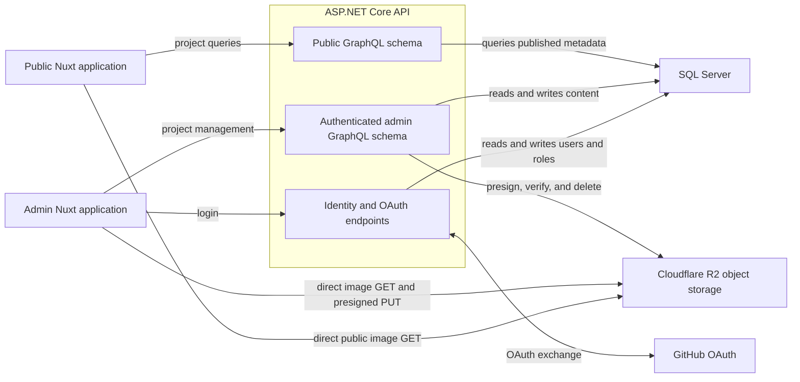
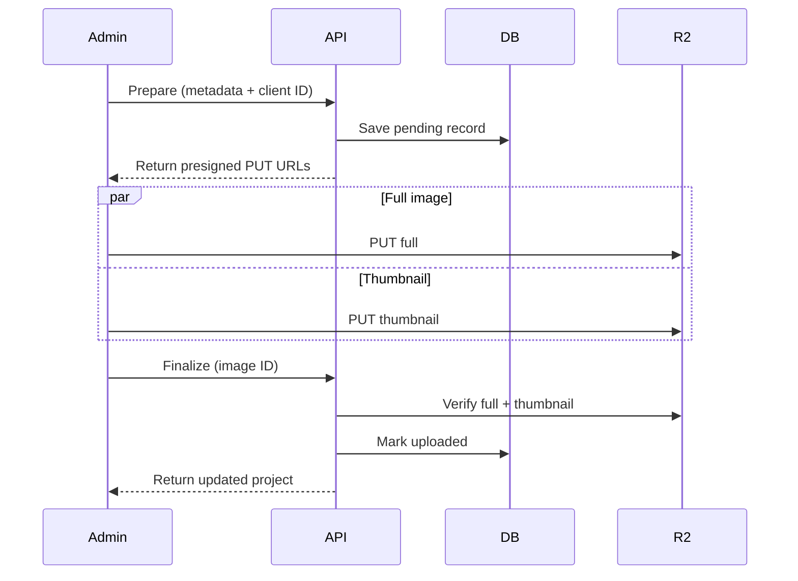

# Gabriel Mioni Portfolio

A full-stack portfolio and small content-management system built to publish project studies without editing source files. The repository contains a public portfolio, an owner-only admin application, a shared GraphQL API, and automated tests that exercise the system from individual utilities through real browser workflows.

This project is currently preparing for its first production deployment.

<!-- TODO: Add screenshots of the public portfolio and admin project editor. -->

## What it does

The public application presents published projects as filterable project studies with responsive image galleries, project links, technology tags, and light and dark themes.

The admin application manages the same content through an editor designed around explicit pending state. Projects, images, links, and tags can be added, removed, restored, and reordered before a save is committed. Image uploads use an idempotent prepare/upload/finalize workflow so interrupted requests can be retried safely.

The API exposes two GraphQL schemas:

- `/graphql` is the public, read-only schema.
- `/graphql/admin` contains project-management queries and mutations.

Expected mutation failures are returned as typed `userErrors`; unexpected execution and infrastructure failures use GraphQL's top-level `errors`. The complete contract is documented in [the GraphQL conventions](Portfolio.Api/GraphQL/README.md).

## Architecture



The Nuxt development servers proxy API requests to ASP.NET Core, keeping browser requests on the frontend origin. In production, the API restricts CORS to the configured public and admin origins. Image bytes do not pass through the API: the API coordinates storage while Admin uploads and displays images directly through R2, and Public reads published images from R2.

### Image upload flow



Client-generated IDs make preparation retry-safe: repeating a request returns instructions for the existing pending image instead of creating a duplicate. Failed uploads are removed through a separate cleanup mutation.

## Technology

| Area | Technology |
| --- | --- |
| API | ASP.NET Core 8, Hot Chocolate GraphQL |
| Data | Entity Framework Core, SQL Server |
| Authentication | ASP.NET Core Identity, GitHub OAuth, secure cookie sessions |
| Object storage | Cloudflare R2 through the AWS S3 SDK |
| Admin | Nuxt 4, Vue 3, Vuetify, URQL, Pinia |
| Public | Nuxt 4, Vue 3, Nuxt UI, URQL |
| API tests | xUnit, `WebApplicationFactory`, Testcontainers for SQL Server |
| Frontend tests | Vitest, Vue Test Utils |
| Browser tests | Playwright |
| Continuous integration | GitHub Actions |

## Repository layout

```text
Portfolio.Api/                  ASP.NET Core API and GraphQL schemas
Portfolio.Admin/                Owner-facing content-management application
Portfolio.Public/               Public portfolio application
Portfolio.Api.IntegrationTests/ API integration tests using an isolated SQL container
Portfolio.Api.StorageTests/     Tests against a dedicated R2 test bucket
Portfolio.E2ETests/             Playwright lifecycle tests across the full system
docs/design/                    Design references and visual experiments
scripts/                        Shared development scripts
```

## Local development

### Prerequisites

- [.NET 8 SDK](https://dotnet.microsoft.com/download/dotnet/8.0)
- Node.js 24 and npm
- SQL Server LocalDB, or another SQL Server instance with an updated connection string
- Docker Desktop for API integration and end-to-end tests
- A Cloudflare R2 bucket and S3-compatible credentials for image uploads

### Install dependencies

Restore the API and install each JavaScript workspace independently:

```powershell
dotnet restore Portfolio.Api/Portfolio.Api.sln

Set-Location Portfolio.Admin
npm ci

Set-Location ../Portfolio.Public
npm ci

Set-Location ../Portfolio.E2ETests
npm ci
npm run install:browsers
```

### Configure the API

The default development connection string uses SQL Server LocalDB with a database named `Portfolio`. Override `ConnectionStrings:DefaultConnection` if you use another SQL Server instance.

Configure R2 through .NET user secrets from `Portfolio.Api`:

```powershell
dotnet user-secrets set "R2:AccessKey" "<access-key>"
dotnet user-secrets set "R2:SecretKey" "<secret-key>"
dotnet user-secrets set "R2:Endpoint" "https://<account-id>.r2.cloudflarestorage.com"
dotnet user-secrets set "R2:Bucket" "<bucket-name>"
dotnet user-secrets set "R2:PublicBaseUrl" "https://<public-bucket-url>"
```

Apply the Entity Framework migrations:

```powershell
dotnet ef database update --project Portfolio.Api
```

Visual Studio's Package Manager Console can run `Update-Database` instead.

GitHub authentication is optional during normal local development. To exercise the real login flow, create a GitHub OAuth application and add these user secrets:

```powershell
dotnet user-secrets set "Authentication:GitHub:ClientId" "<client-id>"
dotnet user-secrets set "Authentication:GitHub:ClientSecret" "<client-secret>"
dotnet user-secrets set "Authentication:GitHub:AllowedUserId" "<numeric-github-user-id>"
```

The OAuth callback URL for the default local API is:

```text
http://localhost:5217/api/auth/github/callback
```

Only the GitHub account matching `AllowedUserId` can be provisioned as an administrator. Successful authentication creates an ASP.NET Core Identity user and issues an HTTP-only cookie session. Development intentionally leaves the admin GraphQL endpoint open; non-development environments require the `Admin` role.

### Configure the frontends

Copy the example environment files when local overrides are needed:

```powershell
Copy-Item Portfolio.Admin/.env.example Portfolio.Admin/.env
Copy-Item Portfolio.Public/.env.example Portfolio.Public/.env
```

Set `NUXT_PUBLIC_STORAGE_BASE` in both files to the public base URL of the R2 bucket. Both applications otherwise default to the local API at `http://localhost:5217`.

### Start the applications

Run each application in its own terminal:

```powershell
dotnet run --project Portfolio.Api --launch-profile http
```

```powershell
Set-Location Portfolio.Admin
npm run dev
```

```powershell
Set-Location Portfolio.Public
npm run dev
```

The default local addresses are:

| Application | Address |
| --- | --- |
| API | `http://localhost:5217` |
| Admin | `http://localhost:3000` |
| Public | `http://localhost:3001` |

The frontend development commands fail when their assigned port is occupied rather than silently selecting another port. This keeps CORS, OAuth callbacks, and test configuration deterministic.

### Generate GraphQL clients

With the API running, regenerate the typed GraphQL clients after changing the schema or an operation:

```powershell
Set-Location Portfolio.Admin
npm run codegen

Set-Location ../Portfolio.Public
npm run codegen
```

CI exports schemas directly from the API executable, so its code-generation jobs do not require a separately hosted API.

## Testing

### API integration tests

```powershell
dotnet test Portfolio.Api.IntegrationTests/Portfolio.Api.IntegrationTests.csproj
```

These tests start an isolated SQL Server container, host the real ASP.NET Core application through `WebApplicationFactory`, and replace external object storage with a fake. Docker must be running.

### R2 storage tests

Copy `.env.test.example` to `.env.test.local`, provide credentials for a dedicated test bucket, then run:

```powershell
dotnet test Portfolio.Api.StorageTests/Portfolio.Api.StorageTests.csproj
```

Never point these tests at a production bucket.

### Frontend tests

```powershell
Set-Location Portfolio.Admin
npm test

Set-Location ../Portfolio.Public
npm run lint
npm run typecheck
npm test
```

### End-to-end tests

The Playwright runner starts a temporary SQL Server container, launches the API and both Nuxt applications on isolated ports, runs the browser lifecycle tests, and removes the container afterward. It uses the same `.env.test.local` R2 configuration as the storage tests.

```powershell
Set-Location Portfolio.E2ETests
npm test
```

Use `npm run test:headed` to watch the browser or `npm run test:ui` to use Playwright's interactive interface.

## Performance auditing

The public application includes a local production-preview wrapper for Windows and Lighthouse as a development dependency:

```powershell
Set-Location Portfolio.Public
npm run build
npm run preview:local
```

In another terminal:

```powershell
npx lighthouse http://localhost:3003/
```

Production assets are precompressed by Nitro and content-hashed assets are served with immutable cache headers.

## Continuous integration

GitHub Actions runs four independent workflows on pull requests and pushes to `main`:

- **API CI** runs SQL-backed integration tests and tests against the dedicated R2 bucket.
- **Admin CI** exports the admin GraphQL schema, generates the client, runs unit tests, and builds the application.
- **Public CI** exports the public schema, generates the client, lints, type-checks, tests, and builds the application.
- **E2E CI** launches the complete system and exercises it through Playwright in Chromium.

R2 credentials are stored as GitHub Actions secrets and are never committed to the repository.

## Deployment

Yet to be determined.
